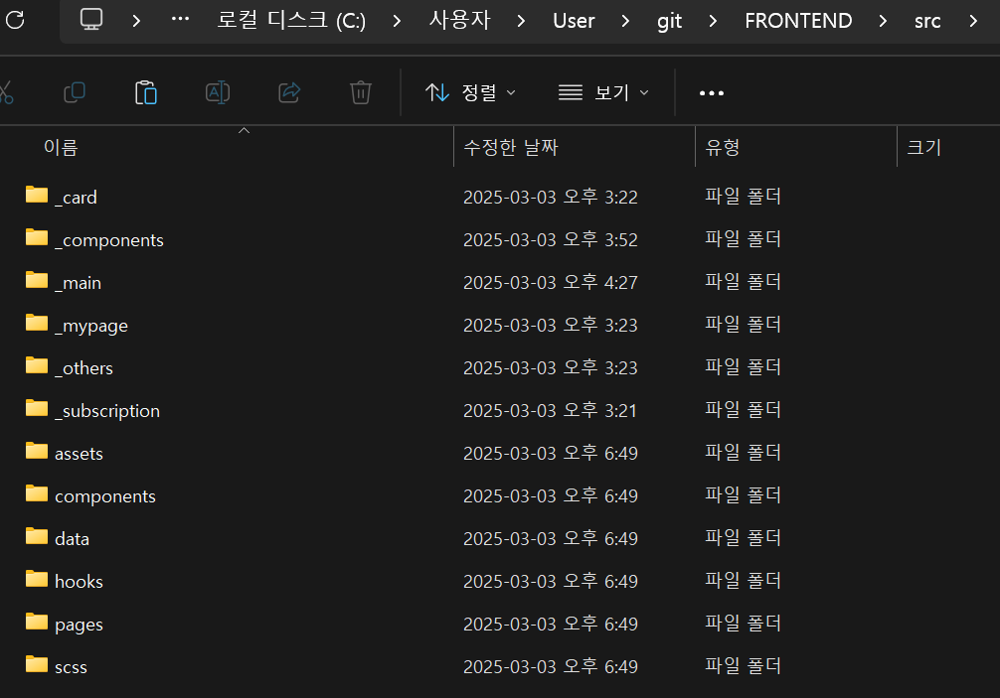

# FRONTEND

쏠로구독(Solo Subscription) 서비스의 프론트엔드 레포지토리입니다. React와 Next.js를 기반으로 작성되었으며, Bootstrap 템플릿을 활용해 UI를 구성했습니다.

## 프로젝트 소개

쏠로구독은 사용자들이 원하는 구독 정보를 쉽게 조회·관리할 수 있도록 지원하고 사용자에게 맞춤형 구독 서비스와 카드를 추천하는 서비스입니다. 이 레포지토리는 해당 서비스의 프론트엔드 코드를 담고 있으며, 백엔드 및 기타 서비스 구성은 별도의 레포지토리를 참고해주세요.

## 기술 스택

- React: UI 라이브러리
- Next.js: React 기반 프레임워크, 서버 사이드 렌더링(SSR) 및 정적 사이트 생성(SSG) 지원
- Bootstrap: UI 컴포넌트 및 스타일
- Node.js / npm: 패키지 관리 및 빌드

## 디렉토리 설명

프로젝트 구조는 크게 부트스트랩 템플릿 관련 폴더와 쏠로구독 페이지 관련 폴더로 나뉩니다.


폴더명 앞에 언더바(*)가 붙은 폴더는 쏠로구독 서비스에 직접적으로 관련된 파일을 담고 있습니다.
언더바가 없는 폴더는 부트스트랩 템플릿에서 제공하는 예시 페이지와 리소스를 모아둔 곳입니다.
충돌을 방지하기 위해 두 영역을 구분했으며, 필요에 따라 템플릿 코드(pages 폴더)를 참조하여 *로 시작하는 폴더 내에서 작업할 수 있습니다.

## 설치 및 실행 방법

### 1. 레포지토리 클론

```
git clone <이 레포지토리 주소>
cd FRONTEND
```

### 2. 의존성 설치

프로젝트에 필요한 npm 패키지를 설치합니다.

```
npm install
```

node_modules 폴더가 없는 경우 필수로 진행

### 3. 빌드

프로덕션 빌드를 위해 .next 폴더가 없다면 아래 명령어를 실행하세요.

```
npm run build
```

npm run build 후 .next 폴더가 생성됩니다.

### 4. 실행

모든 준비가 끝났다면 서버를 실행합니다.

```
npm run start
```

기본적으로 http://localhost:3000 에서 페이지를 확인할 수 있습니다.

개발 모드(선택 사항)
실시간 코드 변경을 반영하며 개발하고 싶다면 아래 명령어를 사용할 수 있습니다.

```
npm run dev
```

npm run dev 실행 시 http://localhost:3000 에서 개발 모드로 프로젝트를 구동합니다.

## 브라우저 렌더링 방법

node_modules가 없는 경우

```
npm install
```

.next 폴더가 없는 경우

```
npm run build
```

모두 있는 경우

```
npm run start
```

## 개발 과정

1. 새로운 페이지나 기능 추가

Bootstrap 템플릿이 필요하다면 pages 폴더에 있는 코드를 참조하세요.
쏠로구독 관련 로직은 \_로 시작하는 폴더에서 구현합니다.

2. 스타일 수정

scss/ 폴더에 Bootstrap 커스텀 SCSS 파일이 위치해 있습니다.
글로벌 스타일 또는 특정 컴포넌트의 스타일을 추가·수정하려면 해당 SCSS를 편집하세요.

3. 컴포넌트 분리

재사용이 필요한 요소는 \_components 폴더 또는 components 폴더(템플릿용)로 분리해 관리합니다.

4. Next.js 라우팅

pages 폴더 구조에 따라 라우팅이 자동 설정됩니다.
필요에 따라 동적 라우팅, API Routes 등을 활용할 수 있습니다.
